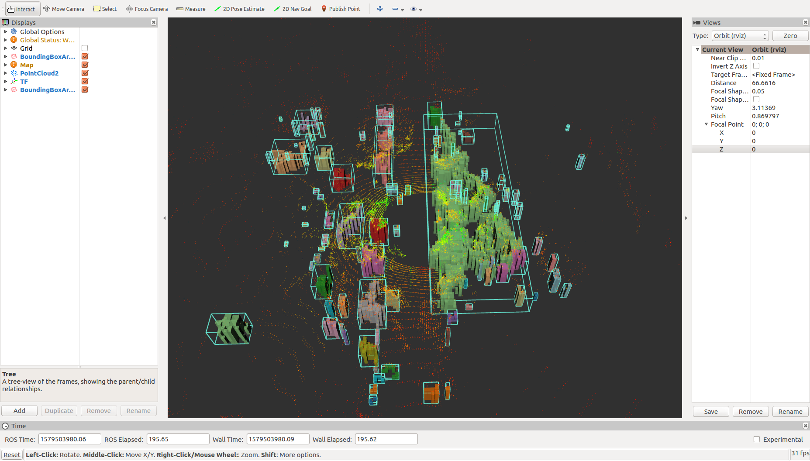
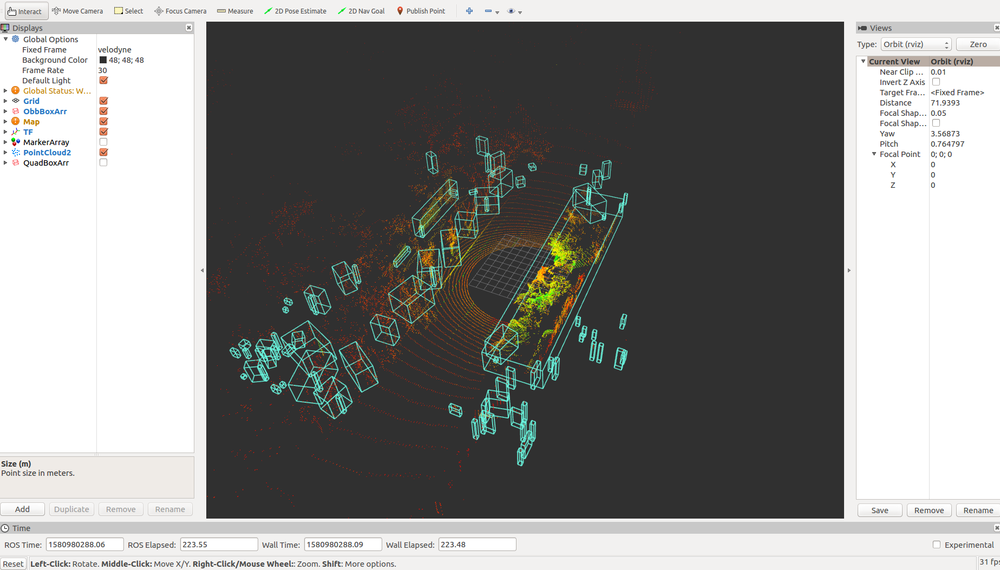
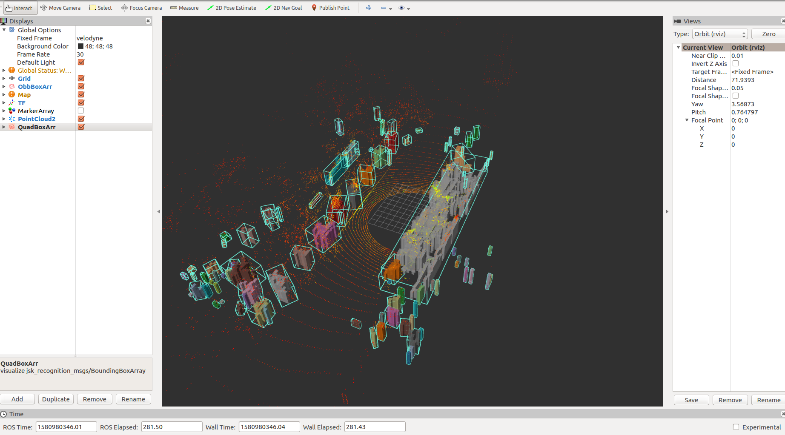

# QT-LiDAR-Object-Detection
  * QT (Quad-Tree Segmentation).
  * Upgrade version of LiDAR-obstacle-dectection Repository.
  * Realtime object recognization, using only LiDAR. 
  * Available for real-time self-driving systems.   
  * More powerful than euclidean clustering detection

# Hardware
* HYUNDAI i30
* Ouster OS1 64 channel LiDAR
* Intel Core i5-8250U, 3.4Ghz
* 16G RAM
* Geforce 1050GTX

# What is changed content
* Add include files.
* Existing method not provide minium size bounding box, but this version is providing.
* Use corvarience of points, and calculate Quaternion and Rotation information of bounding box.
* bounding box's pose has orientation values.

# Input topic
* '/points_raw'

# Output topic
* '/detected_boxes'
* '/obb_cluster'
* '/obb_boxes'

# Run 
```sh
$ roslaunch lidar_detect qt_detect_launch.launch --screen
``` 

# Result
1. Existing method
  * no rotation
  * no minimum size box


2. QT-detect output
 * has rotation
 * minimum size box for clustering obj


